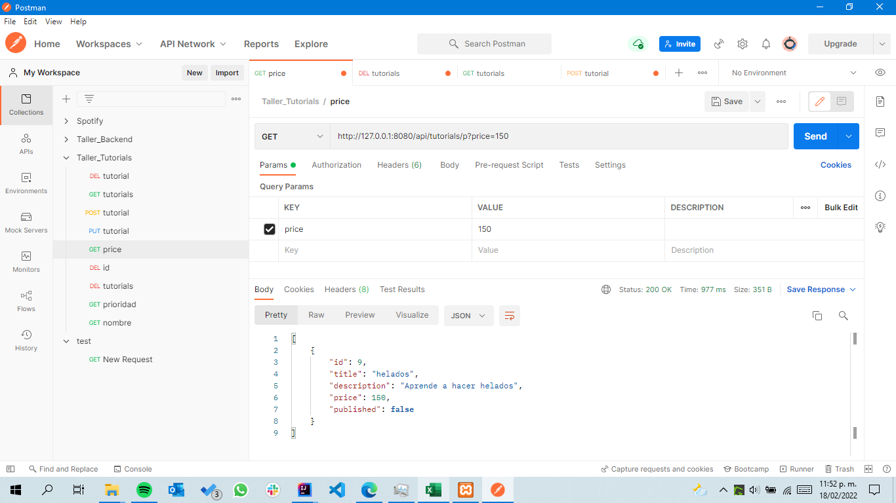
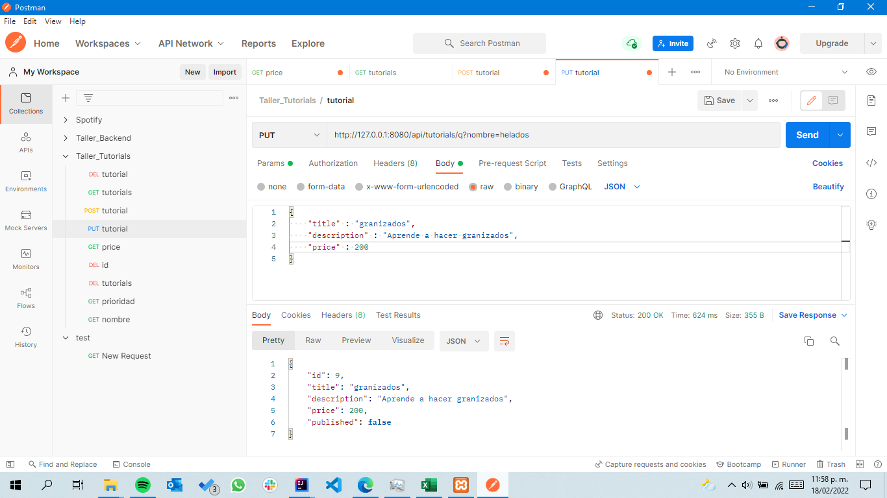
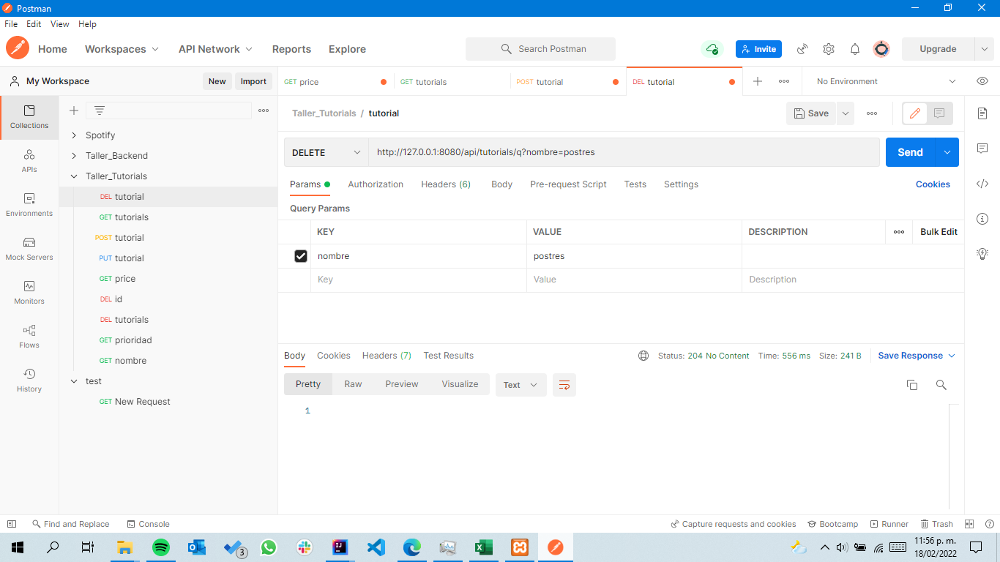

# Spring Boot JPA MySQL - Building Rest CRUD API example
"# API-rest-FULL-Tutorials" 

Se añadieron funcionalidades (Eliminar tutorial por titulo, actualizar tutorial por titulo, consultar por precio del curso).

Consultar por precio

Actualizar por titulo

Eliminar por titulo
